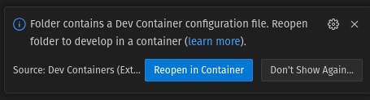

Setting up
==========

There are two way to develop on this library:

-   Using the Dev Container that is provided in the repository
-   Using a local development setup

The former is the easiest and preferred way since that results in correct setup of the environment. The latter is harder to do but gives the programmer more freedom to alter the environment. The following pages will detail how both should be set up.

Dev Container
-------------

Using a Dev Container is the preferred and easiest way to setup the project. To get a primer on Dev Containers, visit the `Dev Container documentation for VScode on VisualStudio.com <https://code.visualstudio.com/docs/devcontainers/containers>`_.

Prerequisites
~~~~~~~~~~~~~

To use the Dev Container, you need to have the following tools:

-   VScode as IDE
-   The ``Dev Container`` extension installed in VScode
-   A container runtime like Docker or Podman.

When you have that, you are ready to go to use the Dev Container.

Using the container
~~~~~~~~~~~~~~~~~~~

Now, you are ready to use the Dev Container. Open the source code for this repository in VScode. VScode will show you a toast indicating to open the Dev Container:

You can now click on **Reopen in Container** and VScode will build and start the container for you. In the folder `/workspaces` you can find this repository. If you by accident dismiss the toast, you can reopen the folder in the DevContainer using the ``Dev Containers: Reopen in Container`` command from the Command Palette.

Local development
-----------------

The other option is to develop locally on your computer. This gives you more freedom in which tools you use.

To do this, you need to do the following steps:

1.  Install `poetry`:

    .. code-block:: bash

        pip install --user poetry

2.  Clone the repository
3.  Navigate to the directory of the repository and install the needed requirements

    .. code-block:: bash

        poetry install --with dev --with doc
    
    Poetry will now install all requirements and dependencies.

You can now start coding. Poetry will create a Python Virtual Environment for you. If you want to execute a command inside this environment, you should use ``poetry run <command>`` or activate the environment. To activate the environment, you need to know where it is placed. You can see this with the command ``poetry env info``.